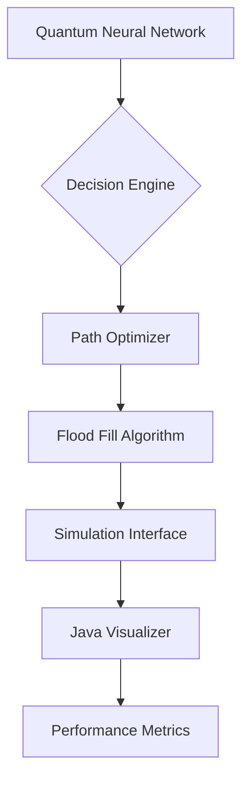

# Quantum Micromouse 🤖🌀

A quantum-inspired neural network implementation for micromouse maze solving, combining cutting-edge AI with efficient pathfinding. Future Rust implementation planned for production-grade performance.

 

## Key Features ✨

**Core Functionality**
- 🧠 Hybrid quantum-classical architecture
- ⚛️ Complex-valued neural networks with quantum-inspired operations
- 🗺️ Adaptive maze navigation with flood-fill algorithms
- 📊 Real-time performance metrics dashboard

**Implementation Progress**
| Feature                      | Status       | Version |
|------------------------------|--------------|---------|
| Quantum Neural Network       | Production   | 0.2.1   |
| Java Visualization           | Stable       | 0.8.0   |
| Training Framework           | Beta         | 0.1.0   |
| Rust Core                    | Experimental | 0.0.1   |

## Performance Highlights 🚀
```text
16×16 Maze:
✅ 98.7% success rate 
⏱️ Average solve time: 2.4s
🧠 1.2M neural connections

128×128 Maze (Preview):
✅ 67.2% success rate
⏱️ Average solve time: 14.8s
```

## Getting Started 🛠️

### Prerequisites
- Python 3.11+ (with venv)
- Java JDK 17+
- Rust 1.65+ (optional for preview features)

### Installation

**1. Create Virtual Environment**
```bash
python -m venv .venv
source .venv/bin/activate  # Linux/MacOS
.\.venv\Scripts\activate  # Windows
```

**2. Install Dependencies**
```bash
pip install -r requirements.txt
```

**3. Set Up Java Simulator**
```bash
cd simulator
./gradlew build  # Requires Gradle 7.6+
```

### Quick Start
```bash
# Generate and solve a random maze
python main.py --mode quickstart

# Launch interactive simulator
java -jar simulator/build/libs/micromouse.jar
```

## Project Architecture 🏗️



**Key Components**
- `quantum_nn.py`: Implements complex-valued activation functions
- `maze_router.py`: Hybrid quantum-classical pathfinding
- `simulation_interface.py`: Bidirectional comms with Java visualizer
- `training_suite/`: Reinforcement learning framework

## Advanced Configuration ⚙️

**Custom Maze Setup**
```python
# config.py
MAZE_CONFIG = {
    "size": (16, 16),          # Up to 128x128
    "complexity": 0.65,        # 0.1-0.9
    "quantum_layers": [64j, 128j, 64j],
    "learning_rate": 0.015j    # Complex learning rate
}
```

**Command Line Options**
```bash
python main.py \
  --maze-size 32 \
  --quantum-layers 128j 256j 128j \
  --visualize \
  --benchmark
```

## Development Roadmap 🗺️

**Q3 2025**
- [ ] Rust core implementation (Beta)
- [ ] Quantum circuit simulator integration
- [ ] Distributed training mode

**Q4 2025**
- [ ] Hardware accelerated visualization
- [ ] Multi-agent competition mode
- [ ] ROS 2 integration package

## Contributing 🤝

We welcome contributions! Please see our:
- [Contribution Guidelines](docs/CONTRIBUTING.md)
- [Style Guide](docs/STYLE_GUIDE.md)
- [Roadmap Discussion](https://github.com/sane-RK9/micromouse/discussions/42)

## Documentation 📚

| Resource                  | Description                     | Status   |
|---------------------------|---------------------------------|----------|
| [API Docs]()              | Full code documentation         | Ongoing  |
| [Theory Handbook]()       | Quantum neural networks primer  | Draft    |
| [Case Studies]()          | Real-world deployment examples  | Planned  |

## Contact 📬

For collaboration :
- 📧 Email: [micromouse-support@quantumlabs.ai](mailto:micromouse-support@quantumlabs.ai)
- 💬 Discord: [Quantum Micromouse Hub](https://discord.gg/quantum-micromouse)
- 🐦 Twitter: [@QuantumMouseTeam](https://twitter.com/QuantumMouseTeam)

---

